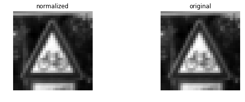

```python
# load pickled data consisting of three environments
import pickle
import random
import matplotlib.pyplot as plt
import matplotlib.image as mpimg
import numpy as np

#enable inline visualization
%matplotlib inline


training_data = "./data/train.p"
testing_data = "./data/test.p"
valid_data = "./data/valid.p"

with open(training_data,mode='rb') as f:
    train = pickle.load(f)
with open(testing_data,mode='rb') as f:
    test = pickle.load(f)
with open(valid_data,mode='rb') as f:
    valid = pickle.load(f)
    

X_train,Y_train = train['features'],train['labels']
X_test,Y_test = test['features'],test['labels']
X_valid,Y_valid = valid['features'],valid['labels']

assert(len(X_train) == len(Y_train))
assert(len(X_valid) == len(Y_valid))
assert(len(X_test) == len(Y_test))


print(" X train shape is ", X_train.shape)
print(" Y train shape is ", Y_train.shape)
print(" X test shape is ", X_test.shape)
print(" Y test shape is ", Y_test.shape)
print(" X valid shape is ", X_valid.shape)
print(" Y valid shape is ", Y_valid.shape)
   
```

     X train shape is  (34799, 32, 32, 3)
     Y train shape is  (34799,)
     X test shape is  (12630, 32, 32, 3)
     Y test shape is  (12630,)
     X valid shape is  (4410, 32, 32, 3)
     Y valid shape is  (4410,)


```python
# print a random image

image_num = random.randint(0,len(X_train))
image = X_train[image_num,:,:,:]

# Show image
print('This image is:', type(image), 'with dimesions:', image.shape)
print('Showing image #', image_num, '...')
plt.imshow(image)  
```

    This image is: <class 'numpy.ndarray'> with dimesions: (32, 32, 3)
    Showing image # 34601 ...


    <matplotlib.image.AxesImage at 0x7fdea6d34f98>


```python

# get number of training entries
no_train = len(X_train)

# get number of testing entries
no_test = len(X_test)

# get number of valid entries
no_valid = len(X_valid)

#get image shape
image_shape = X_train[0].shape

#get unique classes in teh dataset

no_classes = len(np.unique(Y_train))

#print all information

print('No of training entries', no_train)
print('No of training entries - y', len(Y_train))
print('No of testing entries', no_test)
print('No of valid entries', no_valid)

print('No of unique classes', no_classes)
print('image shape is ', image_shape)


```

    No of training entries 34799
    No of training entries - y 34799
    No of testing entries 12630
    No of valid entries 4410
    No of unique classes 43
    image shape is  (32, 32, 3)


```python
# start data visualization


# select random of 10 images
fig, axs = plt.subplots(4,5,figsize =(15,6))
fig.subplots_adjust(hspace=.2,wspace=0.001)
axs = axs.ravel()

for i in range(20):
    index = random.randint(0,len(X_train))
    image = X_train[index]
    axs[i].axis('off')
    axs[i].imshow(image)
    axs[i].set_title(Y_train[index])   


```


```python
# Create histogram of label frequency
hist,bins = np.histogram(Y_train,bins=no_classes)
width=0.7 *(bins[1] - bins[0])
center = (bins[:-1] + bins[1:]) / 2
plt.bar(center,hist,align='center',width=width)
plt.show()
```


```python
# convert to grey scale

X_train_rgb = X_train
X_train_gry = np.sum(X_train/3, axis=3, keepdims=True)

X_test_rgb = X_test
X_test_gry = np.sum(X_test/3, axis=3, keepdims=True)

X_valid_rgb = X_valid
X_valid_gry = np.sum(X_valid/3, axis=3, keepdims=True)


print('RGB shape:', X_train_rgb.shape)
print('Grayscale shape:', X_train_gry.shape)

#overwrite variables with grey shape

X_train = X_train_gry
X_test = X_test_gry
X_valid = X_valid_gry
```

    RGB shape: (34799, 32, 32, 3)
    Grayscale shape: (34799, 32, 32, 1)


```python
# compare Grey scale and RGB

n_rows = 8
n_cols = 10
offset = 9000
fig, axs = plt.subplots(n_rows,n_cols, figsize=(18, 14))
fig.subplots_adjust(hspace = .1, wspace=.001)
axs = axs.ravel()
for j in range(0,n_rows,2):
    for i in range(n_cols):
        index = i + j*n_cols
        image = X_train_rgb[index + offset]
        axs[index].axis('off')
        axs[index].imshow(image)
    for i in range(n_cols):
        index = i + j*n_cols + n_cols
        image = X_train_gry[index + offset - n_cols].squeeze()
        axs[index].axis('off')
        axs[index].imshow(image, cmap='gray')
```


```python
# check if data has to be shuffled

print(np.unique(Y_train))
print(Y_train[0:500])
print(Y_train[501:1000])
```

    [ 0  1  2  3  4  5  6  7  8  9 10 11 12 13 14 15 16 17 18 19 20 21 22 23 24
     25 26 27 28 29 30 31 32 33 34 35 36 37 38 39 40 41 42]
    [41 41 41 41 41 41 41 41 41 41 41 41 41 41 41 41 41 41 41 41 41 41 41 41 41
     41 41 41 41 41 41 41 41 41 41 41 41 41 41 41 41 41 41 41 41 41 41 41 41 41
     41 41 41 41 41 41 41 41 41 41 41 41 41 41 41 41 41 41 41 41 41 41 41 41 41
     41 41 41 41 41 41 41 41 41 41 41 41 41 41 41 41 41 41 41 41 41 41 41 41 41
     41 41 41 41 41 41 41 41 41 41 41 41 41 41 41 41 41 41 41 41 41 41 41 41 41
     41 41 41 41 41 41 41 41 41 41 41 41 41 41 41 41 41 41 41 41 41 41 41 41 41
     41 41 41 41 41 41 41 41 41 41 41 41 41 41 41 41 41 41 41 41 41 41 41 41 41
     41 41 41 41 41 41 41 41 41 41 41 41 41 41 41 41 41 41 41 41 41 41 41 41 41
     41 41 41 41 41 41 41 41 41 41 31 31 31 31 31 31 31 31 31 31 31 31 31 31 31
     31 31 31 31 31 31 31 31 31 31 31 31 31 31 31 31 31 31 31 31 31 31 31 31 31
     31 31 31 31 31 31 31 31 31 31 31 31 31 31 31 31 31 31 31 31 31 31 31 31 31
     31 31 31 31 31 31 31 31 31 31 31 31 31 31 31 31 31 31 31 31 31 31 31 31 31
     31 31 31 31 31 31 31 31 31 31 31 31 31 31 31 31 31 31 31 31 31 31 31 31 31
     31 31 31 31 31 31 31 31 31 31 31 31 31 31 31 31 31 31 31 31 31 31 31 31 31
     31 31 31 31 31 31 31 31 31 31 31 31 31 31 31 31 31 31 31 31 31 31 31 31 31
     31 31 31 31 31 31 31 31 31 31 31 31 31 31 31 31 31 31 31 31 31 31 31 31 31
     31 31 31 31 31 31 31 31 31 31 31 31 31 31 31 31 31 31 31 31 31 31 31 31 31
     31 31 31 31 31 31 31 31 31 31 31 31 31 31 31 31 31 31 31 31 31 31 31 31 31
     31 31 31 31 31 31 31 31 31 31 31 31 31 31 31 31 31 31 31 31 31 31 31 31 31
     31 31 31 31 31 31 31 31 31 31 31 31 31 31 31 31 31 31 31 31 31 31 31 31 31]
    [31 31 31 31 31 31 31 31 31 31 31 31 31 31 31 31 31 31 31 31 31 31 31 31 31
     31 31 31 31 31 31 31 31 31 31 31 31 31 31 31 31 31 31 31 31 31 31 31 31 31
     31 31 31 31 31 31 31 31 31 31 31 31 31 31 31 31 31 31 31 31 31 31 31 31 31
     31 31 31 31 31 31 31 31 31 31 31 31 31 31 31 31 31 31 31 31 31 31 31 31 31
     31 31 31 31 31 31 31 31 31 31 31 31 31 31 31 31 31 31 31 31 31 31 31 31 31
     31 31 31 31 31 31 31 31 31 31 31 31 31 31 31 31 31 31 31 31 31 31 31 31 31
     31 31 31 31 31 31 31 31 31 31 31 31 31 31 31 31 31 31 31 31 31 31 31 31 31
     31 31 31 31 31 31 31 31 31 31 31 31 31 31 31 31 31 31 31 31 31 31 31 31 31
     31 31 31 31 31 31 31 31 31 31 31 31 31 31 31 31 31 31 31 31 31 31 31 31 31
     31 31 31 31 31 31 31 31 31 31 31 31 31 31 31 31 31 31 31 31 31 31 31 31 31
     31 31 31 31 31 31 31 31 31 31 31 31 31 31 31 31 31 31 31 31 31 31 31 31 31
     31 31 31 31 31 31 31 31 31 31 31 31 31 31 31 31 31 31 31 31 31 31 31 31 31
     31 31 31 31 31 31 31 31 31 31 31 31 31 31 31 31 31 31 31 31 31 31 31 31 31
     31 31 31 31 31 31 31 31 31 31 31 31 31 31 31 31 31 31 31 31 31 31 31 31 31
     31 31 31 31 31 31 31 31 31 31 31 31 31 31 31 31 31 31 31 31 31 31 31 31 31
     31 31 31 31 31 31 31 31 31 31 31 31 31 31 31 31 31 31 31 31 31 31 31 31 36
     36 36 36 36 36 36 36 36 36 36 36 36 36 36 36 36 36 36 36 36 36 36 36 36 36
     36 36 36 36 36 36 36 36 36 36 36 36 36 36 36 36 36 36 36 36 36 36 36 36 36
     36 36 36 36 36 36 36 36 36 36 36 36 36 36 36 36 36 36 36 36 36 36 36 36 36
     36 36 36 36 36 36 36 36 36 36 36 36 36 36 36 36 36 36 36 36 36 36 36 36]


```python
X_train_mean = np.mean(X_train)
X_train_std = np.std(X_train)

X_test_mean = np.mean(X_test)
X_test_std = np.std(X_test)

X_valid_mean = np.mean(X_valid)
X_valid_std = np.std(X_valid)


print("mean for X_train", np.mean(X_train))
print("mean for X_test",np.mean(X_test))
print("mean for X_valid",np.mean(X_valid))


print("stddev for X train", np.std(X_train))
print("stdev for X test", np.std(X_test))
print("stdev for X valid", np.std(X_valid))


X_train_normalized = (X_train - X_train_mean)/X_train_std
X_test_normalized = (X_test - X_test_mean)/X_test_std
X_valid_normalized = (X_valid - X_valid_mean)/X_valid_std


print("standardized mean for X_train", np.mean(X_train_normalized))
print("standardized mean for X_test", np.mean(X_test_normalized))
print("standardized mean for X_valid", np.mean(X_valid_normalized))


print("standardized stdev for X_train", np.std(X_train_normalized))
print("standardized stddev for X_test", np.std(X_test_normalized))
print("standardized stddev for X_valid", np.std(X_valid_normalized))

X_train_max = np.max(X_train)
X_train_min = np.min(X_train)
X_train_normalized = (X_train - X_train_min)/(X_train_max - X_train_min)

X_test_max = np.max(X_test)
X_test_min = np.min(X_test)
X_test_normalized = (X_test - X_test_min)/(X_test_max - X_test_min)

X_valid_max = np.max(X_valid)
X_valid_min = np.min(X_valid)
X_valid_normalized = (X_valid - X_valid_min)/(X_valid_max - X_valid_min)

print("Normalized mean for X_train", np.mean(X_train_normalized))
print("Normalized mean for X_test", np.mean(X_test_normalized))
print("Normalized mean for X_valid", np.mean(X_valid_normalized))


print("Normalized stdev for X_train", np.std(X_train_normalized))
print("Normalized stddev for X_test", np.std(X_test_normalized))
print("Normalized stddev for X_valid", np.std(X_valid_normalized))


```

    mean for X_train 82.677589037
    mean for X_test 82.1484603612
    mean for X_valid 83.5564273756
    stddev for X train 66.0097957522
    stdev for X test 66.7642435759
    stdev for X valid 67.9870214471
    standardized mean for X_train 8.21244085217e-16
    standardized mean for X_test 1.58103494227e-15
    standardized mean for X_valid 3.86689924223e-17
    standardized stdev for X_train 1.0
    standardized stddev for X_test 1.0
    standardized stddev for X_valid 1.0
    Normalized mean for X_train 0.314367065134
    Normalized mean for X_test 0.311348447654
    Normalized mean for X_valid 0.314225709503
    Normalized stdev for X_train 0.262638444637
    Normalized stddev for X_test 0.265993002295
    Normalized stddev for X_valid 0.271948085788


```python

# check randmoly few images to check if images are fine


print("Original shape:", X_train.shape)
print("Normalized shape:", X_train_normalized.shape)
for i in range(1,5):
    
    index = random.randint(0,len(X_train_normalized))
    fig, axs = plt.subplots(1,2, figsize=(10, 3))
    axs = axs.ravel()
    axs[0].axis('off')
    axs[0].set_title('normalized')
    axs[0].imshow(X_train_normalized[index].squeeze(), cmap='gray')
    axs[1].axis('off')
    axs[1].set_title('original')
    axs[1].imshow(X_train[index].squeeze(), cmap='gray')

```

    Original shape: (34799, 32, 32, 1)
    Normalized shape: (34799, 32, 32, 1)





```python
import cv2
print(len(X_train))
print(len(Y_train))

index = random.randint(0,len(X_train))

def random_translate(img):
    rows,cols,_ = img.shape
    # allow translation up to px pixels in x and y directions
    px = 2
    dx,dy = np.random.randint(-px,px,2)
    M = np.float32([[1,0,dx],[0,1,dy]])
    dst = cv2.warpAffine(img,M,(cols,rows))
    dst = dst[:,:,np.newaxis]
    return dst

# test this function
test_img = X_train_normalized[index]
test_dst = random_translate(test_img)
fig, axs = plt.subplots(1,2, figsize=(10, 3))
axs[0].axis('off')
axs[0].imshow(test_img.squeeze(), cmap='gray')
axs[0].set_title('original')
axs[1].axis('off')
axs[1].imshow(test_dst.squeeze(), cmap='gray')
axs[1].set_title('translated')
print('shape in/out:', test_img.shape, test_dst.shape)

def random_scaling(img):
    rows,cols,_ = img.shape
    # transform limits
    px = np.random.randint(-2,2)
    # ending locations
    pts1 = np.float32([[px,px],[rows-px,px],[px,cols-px],[rows-px,cols-px]])
    # starting locations (4 corners)
    pts2 = np.float32([[0,0],[rows,0],[0,cols],[rows,cols]])
    M = cv2.getPerspectiveTransform(pts1,pts2)
    dst = cv2.warpPerspective(img,M,(rows,cols))
    dst = dst[:,:,np.newaxis]
    return dst

test_dst = random_scaling(test_img)
fig, axs = plt.subplots(1,2, figsize=(10, 3))
axs[0].axis('off')
axs[0].imshow(test_img.squeeze(), cmap='gray')
axs[0].set_title('original')
axs[1].axis('off')
axs[1].imshow(test_dst.squeeze(), cmap='gray')
axs[1].set_title('scaled')
print('shape in/out:', test_img.shape, test_dst.shape)
    
def random_warp(img):
    rows,cols,_ = img.shape
    # random scaling coefficients
    rndx = np.random.rand(3) - 0.5
    rndx *= cols * 0.06 # this coefficient determines the degree of warping
    rndy = np.random.rand(3) - 0.5
    rndy *= rows * 0.06
    # 3 starting points for transform, 1/4 way from edges
    x1 = cols/4
    x2 = 3*cols/4
    y1 = rows/4
    y2 = 3*rows/4
    pts1 = np.float32([[y1,x1],
    [y2,x1],
    [y1,x2]])
    pts2 = np.float32([[y1+rndy[0],x1+rndx[0]],
    [y2+rndy[1],x1+rndx[1]],
    [y1+rndy[2],x2+rndx[2]]])
    M = cv2.getAffineTransform(pts1,pts2)
    dst = cv2.warpAffine(img,M,(cols,rows))
    dst = dst[:,:,np.newaxis]
    return dst

test_dst = random_warp(test_img)
fig, axs = plt.subplots(1,2, figsize=(10, 3))
axs[0].axis('off')
axs[0].imshow(test_img.squeeze(), cmap='gray')
axs[0].set_title('original')
axs[1].axis('off')
axs[1].imshow(test_dst.squeeze(), cmap='gray')
axs[1].set_title('warped')
print('shape in/out:', test_img.shape, test_dst.shape)
    

def random_brightness(img):
    shifted = img + 1.0 # shift to (0,2) range
    img_max_value = max(shifted.flatten())
    max_coef = 2.0/img_max_value
    min_coef = max_coef - 0.1
    coef = np.random.uniform(min_coef, max_coef)
    dst = shifted * coef - 1.0
    return dst

test_dst = random_brightness(test_img)
fig, axs = plt.subplots(1,2, figsize=(10, 3))
axs[0].axis('off')
axs[0].imshow(test_img.squeeze(), cmap='gray')
axs[0].set_title('original')
axs[1].axis('off')
axs[1].imshow(test_dst.squeeze(), cmap='gray')
axs[1].set_title('brightness adjusted')
print('shape in/out:', test_img.shape, test_dst.shape)
print(len(X_train))
print(len(Y_train))


```

    34799
    34799
    shape in/out: (32, 32, 1) (32, 32, 1)
    shape in/out: (32, 32, 1) (32, 32, 1)
    shape in/out: (32, 32, 1) (32, 32, 1)
    shape in/out: (32, 32, 1) (32, 32, 1)
    34799
    34799


```python
# histogram of label frequency (once again, before data augmentation)
hist, bins = np.histogram(Y_train, bins=no_classes)
width = 0.7 * (bins[1] - bins[0])
center = (bins[:-1] + bins[1:]) / 2
plt.bar(center, hist, align='center', width=width)
plt.show()
```


```python
print(np.unique(Y_train), np.bincount(Y_train))
print("minimum samples for any label:", min(np.bincount(Y_train)))
```

    [ 0  1  2  3  4  5  6  7  8  9 10 11 12 13 14 15 16 17 18 19 20 21 22 23 24
     25 26 27 28 29 30 31 32 33 34 35 36 37 38 39 40 41 42] [ 180 1980 2010 1260 1770 1650  360 1290 1260 1320 1800 1170 1890 1920  690
      540  360  990 1080  180  300  270  330  450  240 1350  540  210  480  240
      390  690  210  599  360 1080  330  180 1860  270  300  210  210]
    minimum samples for any label: 180


```python
print(len(X_train))
print(len(Y_train))
      
print('X, y shapes:', X_train_normalized.shape, Y_train.shape)
input_indices = []
output_indices = []
for class_n in range(no_classes):
    print(class_n, ': ', end='')
    class_indices = np.where(Y_train == class_n)
    n_samples = len(class_indices[0])
    print("no of samples is ", n_samples)
    if n_samples < 600:
        for i in range(600 - n_samples):
            #print('Entered loop')
            input_indices.append(class_indices[0][i%n_samples])
            output_indices.append(X_train_normalized.shape[0])
            new_img = X_train_normalized[class_indices[0][i % n_samples]]
            new_img = random_translate(random_scaling(random_warp(random_brightness(new_img))))
            X_train_normalized = np.concatenate((X_train_normalized, [new_img]), axis=0)
            Y_train = np.concatenate((Y_train, [class_n]), axis=0)
            
    print('')
print('X, y shapes:', X_train_normalized.shape, Y_train.shape)
print(len(X_train))
print(len(Y_train))
print(len(input_indices))
```

    34799
    34799
    X, y shapes: (34799, 32, 32, 1) (34799,)
    0 : no of samples is  180
    
    1 : no of samples is  1980
    
    2 : no of samples is  2010
    
    3 : no of samples is  1260
    
    4 : no of samples is  1770
    
    5 : no of samples is  1650
    
    6 : no of samples is  360
    
    7 : no of samples is  1290
    
    8 : no of samples is  1260
    
    9 : no of samples is  1320
    
    10 : no of samples is  1800
    
    11 : no of samples is  1170
    
    12 : no of samples is  1890
    
    13 : no of samples is  1920
    
    14 : no of samples is  690
    
    15 : no of samples is  540
    
    16 : no of samples is  360
    
    17 : no of samples is  990
    
    18 : no of samples is  1080
    
    19 : no of samples is  180
    
    20 : no of samples is  300
    
    21 : no of samples is  270
    
    22 : no of samples is  330
    
    23 : no of samples is  450
    
    24 : no of samples is  240
    
    25 : no of samples is  1350
    
    26 : no of samples is  540
    
    27 : no of samples is  210
    
    28 : no of samples is  480
    
    29 : no of samples is  240
    
    30 : no of samples is  390
    
    31 : no of samples is  690
    
    32 : no of samples is  210
    
    33 : no of samples is  599
    
    34 : no of samples is  360
    
    35 : no of samples is  1080
    
    36 : no of samples is  330
    
    37 : no of samples is  180
    
    38 : no of samples is  1860
    
    39 : no of samples is  270
    
    40 : no of samples is  300
    
    41 : no of samples is  210
    
    42 : no of samples is  210
    
    X, y shapes: (41460, 32, 32, 1) (41460,)
    34799
    41460
    6661


```python
print(len(X_train_normalized))
print("train normalized mean is", np.mean(X_train_normalized))
```

    41460
    train normalized mean is 0.329363257175


```python
print(len(X_train))
print(len(Y_train))
choices = list(range(len(input_indices)))
picks = []
for i in range(5):
    rnd_index = np.random.randint(low=0,high=len(choices))
    picks.append(choices.pop(rnd_index))
fig, axs = plt.subplots(2,5, figsize=(15, 6))
fig.subplots_adjust(hspace = .2, wspace=.001)
axs = axs.ravel()
for i in range(5):
    image = X_train_normalized[input_indices[picks[i]]].squeeze()
    axs[i].axis('off')
    axs[i].imshow(image, cmap = 'gray')
    axs[i].set_title(Y_train[input_indices[picks[i]]])
for i in range(5):
    image = X_train_normalized[output_indices[picks[i]]].squeeze()
    axs[i+5].axis('off')
    axs[i+5].imshow(image, cmap = 'gray')
    axs[i+5].set_title(Y_train[output_indices[picks[i]]])
```

    34799
    41460


```python
print(len(input_indices))
```

    6661


```python
# histogram of label frequency
hist, bins = np.histogram(Y_train, bins=no_classes)
width = 0.7 * (bins[1] - bins[0])
center = (bins[:-1] + bins[1:]) / 2
plt.bar(center, hist, align='center', width=width)
plt.show()
```


```python
## Shuffle the training dataset
from sklearn.utils import shuffle
X_train_normalized, Y_train = shuffle(X_train_normalized, Y_train)
X_train = X_train_normalized
print('done')

X_test_normalized, Y_test = shuffle(X_test_normalized, Y_test)
X_test = X_test_normalized
print('done')

X_valid_normalized, Y_valid = shuffle(X_valid_normalized, Y_valid)
X_valid = X_valid_normalized
print('done')


# check if data has to be shuffled

print(np.unique(Y_train))
print(Y_train[0:500])
print(Y_train[501:1000])
```

    done
    done
    done
    [ 0  1  2  3  4  5  6  7  8  9 10 11 12 13 14 15 16 17 18 19 20 21 22 23 24
     25 26 27 28 29 30 31 32 33 34 35 36 37 38 39 40 41 42]
    [ 7  0 31  9 31 23 38 25  5 10  1 10 13 21 25 34 10 33 12  9 35 13  6 37 38
     13  4  9 28 24 27 13 26 11 10 40 35 23  4  1  9  0  8 41 19  2  9 16 28  7
      8 37 11 30  0  9  5 10 23 20 26 25 13  8 13 10  2 13 40  1 36 30 32 17 34
     14 37 10 17 25 18 12 19 35 10 17 33  9 32 42 28  8 25 10  1 12 34  3 32  6
     37 27 12 26 38 26  6  0  3 37  7 29  3 38  2 15 32 31  5  0  1 14  9 13 35
     12 41 30  1  6 22 29 21 12 11 38  2  2  7 12 38 35 10 13 38 29 18  2 31 10
     35  4 35 13 22  5 23 13  4  8  1 11  2 38 36 11 29  9 24 12  7 13 16 37  5
      2  9 21  3 42 38  3 42  2 18 35 18 37 19 26 12 13 16 41  7 42  3 34 38  2
     14 38  1 18 18  4 13 12  3  5 38 22 11 10 12 24  1 25 23 24 39  6 24  3 34
     31 30 23 33  5 30 38 13 30 41  3 30 25 35 14 34  4  2 29 26 20  4 30 34 40
     12 38  6 33  4 29  8 42  1  2  2 21 36 30 28 39 38 39 36  5 17 36 13 10 13
     34  2 24 38 11 18 19  8 38 10 10  6 26 18  0 27  5 40 11 42 13 10 29 20  4
     30 22 42 12  1  1 12 13 25  5  8 21 33 17 25 30  7  9  7 13 22 12  9 21 24
     42 25 10 29 37  7 17 36  7 18 36 26 18 34 41 29  4 40 23 10 17 13  5 11 42
     25 18  7 22 42  1 26 11 38 18  7 13 16  1 14 22 26  6 40 25  7  4 39  1 38
     16 19  9 26  2 29 15 18 12 31  8  4  1  4 20 17 41  5  3 23  1  5 10  4 14
     18 16  2  1  2 39 14 33 32 13 17  9 10 17  2 16 22 16 17 24 22  3 16  2 24
      8  9 13 41  3 32 10 35  9  9 16  5 33  1  9 30 13 38 27  2 37 11 14  5 24
     22 42 12 36  5 28 10 41 21  2  7 10 30 25 41  1  9 11  8  1 13 14  9 33 36
     16 24  5  8 39  2 18  4 35 15  2 12 13  1 18 13 28 28  3 16 19 31  7 38  7]
    [25 13 17 29  1 13 26  1 37  8 21  2 19 16 10  7 25  1 32 12 38  7  1  6 13
     42 10 41 29 38 35 42 10 37 33 24 18 33  1 41  5 24 12 23  2 13 38 25 10 18
     38 13 25  5 38 31 13  2 42 16 11  3  6 13  1  7 11  5  6  2 18  3 14 28  6
      8  7  4 28 38 12 26 12 34 35  3  7  8 18 17 10  7  7 31 14  4  9 26 20  5
     18  2  4 15 38 33 12 34 14  1 32  3  5 35  2 31  1 38  4 27  5 23 12  2  5
     38  4  2 18 17  3  9  1 25 24  1  8 41 40  2  5  7 12  1 12  1 41 13 23 26
     13  8 25  2  8  9  8 32 13 34 36 10 34 10  8  1 20 36 13  4  9  7 25  8  3
     38  1  1  4 12 28 36 25  0  5  3 41 38  5  1  8 22  4 17 33 27  2 33  6  4
      3 36  8  5 38  2 42  7 40 25  6 13 38 21 27 17  5  9  2 25  7  7 22 38 20
     37  1  4  4  1 13 31  0  5 10 12  6 38 40  4  4 31 37 25  4  1 17 14 26  7
     23  3 33 34  5 42 13 13 10 18 10  4  2 38 21 10  6 18 18 18  2 18 26  5 12
      2 28 26  1 32 14 22 11  6 27 17 38 17 30  4 17 10 38  2 14  0 20 31 38  2
     11 31  4  3  4 17 25 24 30 42  9  8 20 15  2  7 25  1 38  1  9 10  0  1 21
     41 35 38 31 25 10 10  4  5  3 17  0  9 12 34 37 31 32 36 36 41  2 13 16 13
      9  1 42 37 20 39 38 18 13  2  1  7  4 11 23  4 32 11 18 18 28  1 10 12 40
      1  5 11  8 17 12  7 36 10 39  8  4 13 41  1 25 17 18  8 37 11 13  2 26 13
     15 10 38  9  9  7 15  4 13 14  1  4  8 16  3 42  8 18  2  2  4 38 16 18 27
     34  5  8 27  1 22 36 22 16 29 19 35  5  2 36 14 34 18 13 13 34 38 18 22  2
      9 37  1 22 10 23  5 13 35 13 30 32  6 10  8 11 17 35 20 36  2  4  9 17  2
     10 11 11 32  9  8 33 29  7 11 10 28 32 31  2 16 10 13 10  1 40  4 27  7]


```python
import tensorflow as tf
EPOCHS = 52
BATCH_SIZE = 84
print('done')
```

    done


```python
from tensorflow.contrib.layers import flatten
def LeNet(x):    
    # Arguments used for tf.truncated_normal, randomly defines variables for the weights and biases for each layer
    mu = 0
    sigma = 0.1
    
    # SOLUTION: Layer 1: Convolutional. Input = 32x32x1. Output = 28x28x6.
    conv1_W = tf.Variable(tf.truncated_normal(shape=(5, 5, 1, 6), mean = mu, stddev = sigma))
    conv1_b = tf.Variable(tf.zeros(6))
    conv1   = tf.nn.conv2d(x, conv1_W, strides=[1, 1, 1, 1], padding='VALID') + conv1_b

    # SOLUTION: Activation.
    conv1 = tf.nn.relu(conv1)

    # SOLUTION: Pooling. Input = 28x28x6. Output = 14x14x6.
    conv1 = tf.nn.max_pool(conv1, ksize=[1, 2, 2, 1], strides=[1, 2, 2, 1], padding='VALID')

    # SOLUTION: Layer 2: Convolutional. Output = 10x10x16.
    conv2_W = tf.Variable(tf.truncated_normal(shape=(5, 5, 6, 16), mean = mu, stddev = sigma))
    conv2_b = tf.Variable(tf.zeros(16))
    conv2   = tf.nn.conv2d(conv1, conv2_W, strides=[1, 1, 1, 1], padding='VALID') + conv2_b
    
    # SOLUTION: Activation.
    conv2 = tf.nn.relu(conv2)

    # SOLUTION: Pooling. Input = 10x10x16. Output = 5x5x16.
    conv2 = tf.nn.max_pool(conv2, ksize=[1, 2, 2, 1], strides=[1, 2, 2, 1], padding='VALID')

    # SOLUTION: Flatten. Input = 5x5x16. Output = 400.
    fc0   = flatten(conv2)
    
    # SOLUTION: Layer 3: Fully Connected. Input = 400. Output = 120.
    fc1_W = tf.Variable(tf.truncated_normal(shape=(400, 120), mean = mu, stddev = sigma))
    fc1_b = tf.Variable(tf.zeros(120))
    fc1   = tf.matmul(fc0, fc1_W) + fc1_b
    
    # SOLUTION: Activation.
    fc1    = tf.nn.relu(fc1)
    fc1    = tf.nn.dropout(fc1,keep_prob)

    # SOLUTION: Layer 4: Fully Connected. Input = 120. Output = 84.
    fc2_W  = tf.Variable(tf.truncated_normal(shape=(120, 84), mean = mu, stddev = sigma))
    fc2_b  = tf.Variable(tf.zeros(84))
    fc2    = tf.matmul(fc1, fc2_W) + fc2_b
    
    # SOLUTION: Activation.
    fc2    = tf.nn.relu(fc2)
    fc2    = tf.nn.dropout(fc2,keep_prob)

    # SOLUTION: Layer 5: Fully Connected. Input = 84. Output = 10.
    fc3_W  = tf.Variable(tf.truncated_normal(shape=(84, 43), mean = mu, stddev = sigma))
    fc3_b  = tf.Variable(tf.zeros(43))
    logits = tf.matmul(fc2, fc3_W) + fc3_b
    
    return logits
print('done')
```

    done


```python
x = tf.placeholder(tf.float32,(None,32,32,1))
y = tf.placeholder(tf.int32,(None))
keep_prob  = tf.placeholder(tf.float32)
one_hot_y = tf.one_hot(y,43)
print('done')

```

    done


```python
rate = 0.0009
logits = LeNet(x)
cross_entropy = tf.nn.softmax_cross_entropy_with_logits(labels=one_hot_y, logits=logits)
loss_operation = tf.reduce_mean(cross_entropy)
optimizer = tf.train.AdamOptimizer(learning_rate = rate)
training_operation = optimizer.minimize(loss_operation)
```


```python
correct_prediction = tf.equal(tf.argmax(logits, 1), tf.argmax(one_hot_y, 1))
accuracy_operation = tf.reduce_mean(tf.cast(correct_prediction, tf.float32))
saver = tf.train.Saver()


```


```python
def evaluate(X_data, y_data):
    num_examples = len(X_data)
    total_accuracy = 0
    sess = tf.get_default_session()
    for offset in range(0, num_examples, BATCH_SIZE):
        batch_x, batch_y = X_data[offset:offset+BATCH_SIZE], y_data[offset:offset+BATCH_SIZE]
        accuracy = sess.run(accuracy_operation, feed_dict={x: batch_x, y: batch_y, keep_prob: 1.0})
        total_accuracy += (accuracy * len(batch_x))
    return total_accuracy / num_examples
print('done')


```

    done


```python
with tf.Session() as sess:
    sess.run(tf.global_variables_initializer())
    num_examples = len(X_train)
    print("Training...")
 
   
   
    for i in range(EPOCHS):
        X_train, Y_train = shuffle(X_train, Y_train)
        for offset in range(0, num_examples, BATCH_SIZE):
            end = offset + BATCH_SIZE
            batch_x, batch_y = X_train[offset:end], Y_train[offset:end]
            sess.run(training_operation, feed_dict={x: batch_x, y: batch_y, keep_prob: 0.5})
        validation_accuracy = evaluate(X_valid, Y_valid)
        print("EPOCH {} ...".format(i+1))
        print("Validation Accuracy = {:.3f}".format(validation_accuracy))
        print()
    saver.save(sess, 'lenet')
    print("Model saved")
```

    Training...
    EPOCH 1 ...
    Validation Accuracy = 0.657
    
    EPOCH 2 ...
    Validation Accuracy = 0.810
    
    EPOCH 3 ...
    Validation Accuracy = 0.852
    
    EPOCH 4 ...
    Validation Accuracy = 0.869
    
    EPOCH 5 ...
    Validation Accuracy = 0.887
    
    EPOCH 6 ...
    Validation Accuracy = 0.899
    
    EPOCH 7 ...
    Validation Accuracy = 0.920
    
    EPOCH 8 ...
    Validation Accuracy = 0.924
    
    EPOCH 9 ...
    Validation Accuracy = 0.930
    
    EPOCH 10 ...
    Validation Accuracy = 0.928
    
    EPOCH 11 ...
    Validation Accuracy = 0.937
    
    EPOCH 12 ...
    Validation Accuracy = 0.951
    
    EPOCH 13 ...
    Validation Accuracy = 0.947
    
    EPOCH 14 ...
    Validation Accuracy = 0.951
    
    EPOCH 15 ...
    Validation Accuracy = 0.954
    
    EPOCH 16 ...
    Validation Accuracy = 0.948
    
    EPOCH 17 ...
    Validation Accuracy = 0.954
    
    EPOCH 18 ...
    Validation Accuracy = 0.956
    
    EPOCH 19 ...
    Validation Accuracy = 0.957
    
    EPOCH 20 ...
    Validation Accuracy = 0.957
    
    EPOCH 21 ...
    Validation Accuracy = 0.955
    
    EPOCH 22 ...
    Validation Accuracy = 0.954
    
    EPOCH 23 ...
    Validation Accuracy = 0.960
    
    EPOCH 24 ...
    Validation Accuracy = 0.957
    
    EPOCH 25 ...
    Validation Accuracy = 0.959
    
    EPOCH 26 ...
    Validation Accuracy = 0.961
    
    EPOCH 27 ...
    Validation Accuracy = 0.961
    
    EPOCH 28 ...
    Validation Accuracy = 0.965
    
    EPOCH 29 ...
    Validation Accuracy = 0.965
    
    EPOCH 30 ...
    Validation Accuracy = 0.962
    
    EPOCH 31 ...
    Validation Accuracy = 0.969
    
    EPOCH 32 ...
    Validation Accuracy = 0.963
    
    EPOCH 33 ...
    Validation Accuracy = 0.964
    
    EPOCH 34 ...
    Validation Accuracy = 0.968
    
    EPOCH 35 ...
    Validation Accuracy = 0.961
    
    EPOCH 36 ...
    Validation Accuracy = 0.969
    
    EPOCH 37 ...
    Validation Accuracy = 0.967
    
    EPOCH 38 ...
    Validation Accuracy = 0.960
    
    EPOCH 39 ...
    Validation Accuracy = 0.963
    
    EPOCH 40 ...
    Validation Accuracy = 0.963
    
    EPOCH 41 ...
    Validation Accuracy = 0.966
    
    EPOCH 42 ...
    Validation Accuracy = 0.963
    
    EPOCH 43 ...
    Validation Accuracy = 0.966
    
    EPOCH 44 ...
    Validation Accuracy = 0.964
    
    EPOCH 45 ...
    Validation Accuracy = 0.963
    
    EPOCH 46 ...
    Validation Accuracy = 0.966
    
    EPOCH 47 ...
    Validation Accuracy = 0.962
    
    EPOCH 48 ...
    Validation Accuracy = 0.965
    
    EPOCH 49 ...
    Validation Accuracy = 0.966
    
    EPOCH 50 ...
    Validation Accuracy = 0.973
    
    EPOCH 51 ...
    Validation Accuracy = 0.966
    
    EPOCH 52 ...
    Validation Accuracy = 0.964
    
    Model saved


```python
with tf.Session() as sess:
    saver.restore(sess, tf.train.latest_checkpoint('.'))

    test_accuracy = evaluate(X_test, Y_test)
    print("Test Accuracy = {:.3f}".format(test_accuracy))
```

    Test Accuracy = 0.945


```python
# now test with new images

import os
import matplotlib.image as mpimg
import matplotlib.pyplot as plt
import cv2
import numpy as np
import csv


#enable inline visualization
%matplotlib inline

folder_name = 'images1/'
img_labels = np.array([22,35,18,1,18,18,1])

#folder_name='images2/'
#img_labels = np.array([22,35,15,18,1,37])


print(folder_name)


get_label = np.genfromtxt('data/signnames.csv', skip_header=1, dtype=[('myint','i8'), ('mystring','S55')],
delimiter=',')

fig, axs = plt.subplots(2,5, figsize=(4, 2))
fig.subplots_adjust(hspace = .2, wspace=.001)
axs = axs.ravel()

index = 0
my_images = []


labels = {}

#22 - bumpy road
#35 - Ahead only
#18 - General caution
#1 - 30 kms per hour
#15 - No vehicles
#37- go straight or left

for i, img in enumerate(os.listdir(folder_name)):
    if img[-3:] in ('png', 'jpg'):
        image = cv2.imread(folder_name + img)
        axs[index].axis('off')
        axs[index].imshow(cv2.cvtColor(image, cv2.COLOR_BGR2RGB))
        print('index is ', index)
        labels[index]= get_label[img_labels[index]][1].decode('ascii')
        print('label index is ', labels[index])
        print(folder_name + img)
        my_images.append(image)
        index = index + 1

my_images = np.asarray(my_images)
                        
my_images_gry = np.sum(my_images/3, axis=3, keepdims=True)
                        
my_images_normalized = (my_images_gry - 128)/128
                        
print(my_images_normalized.shape)

```

    images1/
    index is  0
    label index is  Bumpy road
    images1/2.png
    index is  1
    label index is  Ahead only
    images1/3.png
    index is  2
    label index is  General caution
    images1/1 (2).png
    index is  3
    label index is  Speed limit (30km/h)
    images1/1b.png
    index is  4
    label index is  General caution
    images1/1.jpg
    index is  5
    label index is  General caution
    images1/6.png
    index is  6
    label index is  Speed limit (30km/h)
    images1/1.png
    (7, 32, 32, 1)


```python
# test the new images
with tf.Session() as sess:
    sess.run(tf.global_variables_initializer())
    # saver = tf.train.import_meta_graph('./lenet.meta')
    #saver.restore(sess, "./lenet")
    saver.restore(sess, tf.train.latest_checkpoint('.'))
    my_accuracy = evaluate(my_images_normalized, img_labels)
    print("My Data Set Accuracy = {:.3f}".format(my_accuracy))
```

    My Data Set Accuracy = 1.000


```python
# test each images

single_image = []
single_image_label = []
no_of_images = 6

for index in range(no_of_images):
    print("current index is ", index)
    single_image = []
    single_image_label = []
    single_image.append(my_images_normalized[index])
    single_image_label.append(img_labels[index])
    print(len(single_image))
    print(len(single_image_label))
    
    with tf.Session() as sess:
        sess.run(tf.global_variables_initializer())
        # saver.restore(sess, "./lenet")
        saver.restore(sess, tf.train.latest_checkpoint('.'))
        model_accuracy = evaluate(single_image, single_image_label)
        print('Image {}'.format(index+1))
        print("Image Accuracy = {:.3f}".format(my_accuracy))
        print()
        
```

    current index is  0
    1
    1
    Image 1
    Image Accuracy = 1.000
    
    current index is  1
    1
    1
    Image 2
    Image Accuracy = 1.000
    
    current index is  2
    1
    1
    Image 3
    Image Accuracy = 1.000
    
    current index is  3
    1
    1
    Image 4
    Image Accuracy = 1.000
    
    current index is  4
    1
    1
    Image 5
    Image Accuracy = 1.000
    
    current index is  5
    1
    1
    Image 6
    Image Accuracy = 1.000
    


```python
#define all required inputs/function
k_size = 5 # top 5 softmax output
softmax_logits = tf.nn.softmax(logits)
top_k = tf.nn.top_k(softmax_logits, k = k_size)

with tf.Session() as sess:
    sess.run(tf.global_variables_initializer())
    saver.restore(sess, tf.train.latest_checkpoint('.'))
    my_softmax_logits = sess.run(softmax_logits, feed_dict={x: my_images_normalized, keep_prob: 1.0})
    my_top_k = sess.run(top_k, feed_dict={x: my_images_normalized, keep_prob: 1.0})
    print(my_top_k)
    
```

    TopKV2(values=array([[  1.00000000e+00,   1.13607684e-18,   2.77682011e-20,
              3.19724472e-21,   2.99252838e-23],
           [  1.00000000e+00,   1.19742632e-10,   1.18682304e-11,
              5.34357714e-12,   1.61243360e-12],
           [  9.99963403e-01,   3.64561020e-05,   1.03646521e-07,
              1.20610233e-09,   6.23700050e-11],
           [  9.95573044e-01,   4.42113867e-03,   3.77527635e-06,
              1.02757645e-06,   9.17257353e-07],
           [  9.99965906e-01,   3.39920553e-05,   1.38865445e-07,
              1.34016243e-09,   6.31852140e-11],
           [  1.00000000e+00,   5.54507640e-36,   4.23992863e-36,
              0.00000000e+00,   0.00000000e+00],
           [  9.97676194e-01,   2.32379045e-03,   3.97210975e-08,
              6.98274424e-11,   5.58187512e-15]], dtype=float32), indices=array([[22, 29, 26, 25, 28],
           [35, 34, 36,  9,  3],
           [18, 26, 36, 22, 33],
           [ 1,  4, 14, 13, 38],
           [18, 26, 36, 22, 33],
           [18, 26, 27,  0,  1],
           [ 1,  4, 14, 40,  2]], dtype=int32))


```python

```
